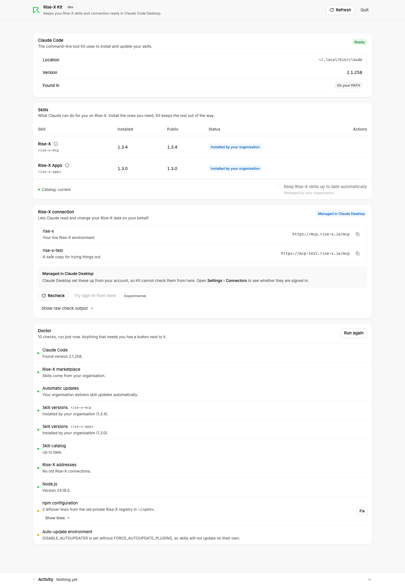

# Rise-X Kit

Rise-X Kit is a small desktop helper that keeps your Rise-X skills and connection
ready in Claude Code Desktop. It's built for partners who don't use a terminal
beyond pasting one line, once, to install it. After that, it runs as a local web
page where you install, update, and remove your Rise-X skills; check your Rise-X
connection and see the exact steps to fix it; turn on automatic updates so skill
fixes arrive on their own; and run a health check with buttons that fix what it
finds.



## Install (partners)

**macOS** — open Terminal and run:

```
curl -fsSL https://raw.githubusercontent.com/rise-x/rise-x-ai-public-marketplace/main/kit/install.sh | sh
```

**Windows** — open PowerShell and run:

```
irm https://raw.githubusercontent.com/rise-x/rise-x-ai-public-marketplace/main/kit/install.ps1 | iex
```

### Run it

On macOS, the installer prints a line to add to `~/.zshrc` if `rise-x-kit` isn't
on your PATH yet. Run that line if you see it, then open a new Terminal window
and type `rise-x-kit`. On Windows, open the Start menu and select **Rise-X
Kit**.

Rise-X Kit opens its page in your default browser, at a local address such as
`http://127.0.0.1:53210/`. Closing that browser tab doesn't stop the app — click
**Quit** in the page when you're done.

**What it needs:**

- Claude Code Desktop, installed
- A Rise-X tenant account, for the Rise-X connection — see
  [Connecting to Rise-X from Claude](../README.md#connecting-to-rise-x-from-claude)
  in the marketplace README

**Unsigned build:** these builds aren't code-signed yet. On macOS this only
matters if you download the binary through a browser instead of the command
above, since a browser download can trigger a "developer cannot be verified"
warning that the install script itself avoids. On Windows, SmartScreen blocks
an unsigned executable that carries the mark of the web, no matter where you
launch it from (Start Menu, taskbar, or a desktop shortcut). `install.ps1`
removes that mark with `Unblock-File`, so the one-line installer command above
doesn't trigger SmartScreen; a zip downloaded through a browser does. If you
see the warning, choose **More info**, then **Run anyway**. Signed builds via
[Azure Artifact Signing](https://learn.microsoft.com/en-us/azure/artifact-signing/)
are planned.

## What each section does

**Summary** is the banner under the page header: it says whether your setup is
ready, and links straight to any check that needs you.

**Claude Code** shows the `claude` CLI that Rise-X Kit found — its path and
version — or, if none is found, an **Install** button and a **Rescan** button.

**Skills** lists your installed Rise-X skills next to the public catalog, with a
status for each: up to date, update available, not installed, version unknown, or
disabled. Each row has **Install**, **Update**, and **Remove** buttons.

A skill can also arrive without you installing it: your organisation can push
it to your Claude account, and Claude Desktop then sets it up for you. Rise-X
Kit shows those rows as **Installed by your organisation**, with no buttons —
installing the same skill from the public marketplace would leave you with two
copies. A skill you installed from another marketplace that mirrors the public
one reads **Installed from &lt;marketplace&gt;**, and updates from that same
marketplace.

**Rise-X connection** shows whether the two Rise-X MCP (Model Context Protocol,
the interface Claude uses to reach Rise-X) servers are connected, with three
steps to connect them:

1. In Claude Desktop, go to **Customize** > **Connectors**, then press **Add**.
2. Enter the name and URL for each server: `rise-x-test` at
   `https://mcp-test.rise-x.io/mcp`, and `rise-x` at `https://mcp.rise-x.io/mcp`.
3. Sign in when your browser prompts you.

Connectors added in Claude Desktop before Rise-X moved to `mcp.rise-x.io` still
point at the old address. Rise-X Kit lists any it finds under **Old Rise-X
addresses**, with a **Fix** button for the ones added with the `claude` CLI;
connectors the Desktop app owns have to be removed and re-added in
**Customize** > **Connectors**.

When your organisation delivers the Rise-X skill, its connections belong to
Claude Desktop. `claude mcp list` cannot see them, so the card reads **Managed
in Claude Desktop** and shows the addresses from the skill's own configuration.

**Automatic updates** is a switch that turns on marketplace auto-update, so skill
fixes arrive in the background instead of waiting for a manual update.

**Doctor** runs a checklist and offers a **Fix** button wherever one applies:

| Check | What it means | What Fix does |
|---|---|---|
| Claude Code CLI | Whether `claude` was found, and its version | Installs the CLI, then rescans |
| Rise-X marketplace | Whether the Rise-X marketplace is registered. Reads "Skills come from your organisation" when every skill is delivered by your account | Registers the marketplace |
| Auto-update | Whether marketplace auto-update is on, for whichever marketplace your skills came from. Your organisation's own deliveries need no switch | Turns auto-update on for that marketplace |
| Each skill | Whether it's installed, enabled, and current, and where it came from: the public marketplace, another marketplace, or your organisation | Installs or updates that skill — never one your organisation or another marketplace delivered |
| Catalog freshness | Whether the local marketplace clone matches GitHub | Refreshes the marketplace |
| Rise-X addresses | Whether any MCP connection still points at an address Rise-X has moved off | Removes the connection and adds it back at the current address, in the same scope |
| Node.js | Whether Node.js 20 or later is available (only the app-building skill needs it) | Installs or updates Node.js to the current LTS release — with nvm on macOS and Linux, winget on Windows. Where neither is available, links to nodejs.org instead |
| `.npmrc` | Whether a leftover `@rise-x:registry` line still points `@rise-x` packages at their old host — they're on the public npm registry now. Auth lines are never touched, whatever host they name. **Show lines** lists the offending line, masked | Backs up `~/.npmrc` first, then rewrites that line to point at the public npm registry |
| Git (Windows only) | Whether `git` is on `PATH` | None — Claude Code Desktop prompts to install it |
| Auto-updater environment | Whether your Claude Code settings' `env` block is blocking plugin auto-updates | None — informational only |

**Activity** is a drawer at the bottom of the page listing every command Rise-X
Kit ran, with its streamed output, so you can see exactly what happened.

## Privacy and safety

Rise-X Kit binds to `127.0.0.1` only, so nothing on your network can reach it. It
runs `claude` commands on your behalf, and every command it runs shows in
**Activity**. The only files it edits directly are `~/.claude/settings.json` (one
setting, with a backup made first) and `~/.npmrc`; MCP connections are changed
by running `claude mcp remove` and `claude mcp add`, never by editing
`~/.claude.json`, which Kit only reads. Kit reads `~/.npmrc` to find a
leftover `@rise-x:registry` line, shows it masked, and backs up the file with
its original permissions before rewriting that line to point at the public npm
registry; auth lines are never touched, whatever host they name. It never
sends the file's contents anywhere. The Node.js fix runs nvm's own installer (a pinned release,
checked against its sha256 before it runs) or winget, and lets that tool edit
your shell profile the way it normally does, so new shells find Node.
The automatic-updates switch writes a documented Claude Code
setting; whether Claude Code honors that setting at user scope isn't confirmed
yet. Signing in to Rise-X always happens in Claude and your browser, never
inside Rise-X Kit.


## For maintainers

**Build and test** (from `kit/`, independent of the rest of this repo):

```
go build ./cmd/rise-x-kit
go test ./...
```

Go 1.23, no third-party dependencies.

**Layout:**

- `cmd/rise-x-kit` — entry point: flags, the CSRF token, the listener, and the
  browser launch.
- `internal/buildinfo` — version and commit, set by `-ldflags` at release build
  time.
- `internal/catalog` — reads plugin versions from the local marketplace clone and
  from GitHub, and compares clone HEAD to GitHub HEAD for the freshness check.
- `internal/claudecli` — locates the `claude` binary and wraps its JSON output.
- `internal/doctor` — turns gathered facts into the checklist above.
- `internal/jobs` — tracks the one write job Rise-X Kit runs at a time, with a
  pollable log.
- `internal/mcp` — parses `claude mcp list`, reads each skill's `.mcp.json` for
  connector URLs, and scans `~/.claude.json` and the Desktop app's config for
  connections still on an old Rise-X address (`oldHostSuffixes` and
  `exactStaleHosts` in `stale.go` are the one place those addresses are listed).
- `internal/npmrc` — finds and repoints leftover `@rise-x:registry` lines in
  `~/.npmrc`.
- `internal/runner` — runs external commands without a shell.
- `internal/server` — the HTTP API the page calls, including its CSRF and host
  checks.
- `internal/settings` — the one writer for `~/.claude/settings.json`.
- `internal/synced` — reads the plugins Claude Desktop materialises from your
  Claude account, which `claude plugin list` does not report.
- `internal/web` — the embedded HTML, CSS, and JS for the page.

**Design system vendoring:** `kit/scripts/sync-ui.sh [version]` fetches
`@rise-x/apps-sdk` from the public npm registry — pinned to the script's
`APPS_SDK_VERSION` constant unless a version argument overrides it — and copies
its `build/ui/styles.css` into `kit/internal/web/rise-x-ui.css` and its
`build/ui/demo.html` into `kit/design/reference/demo.html`, so the page ships
the current Rise-X look without a Node.js build step. The resolved version and
the tarball's sha256 are recorded in the first line of `rise-x-ui.css`; run
`kit/scripts/sync-ui.sh --verify` to re-download that pinned tarball and fail if
its sha256 no longer matches. Only a maintainer runs either mode, after a
deliberate `@rise-x/apps-sdk` version bump. The static design mock this UI was
built from lives at `kit/design/mock.html`.

**Release:** kit changes collect on a `release-kit/<name>` branch, cut from
`main` by the `create-release-kit.yml` workflow; only one such branch exists
at a time. When the branch is ready to ship, open a PR from
`release-kit/<name>` into `main` and raise `kit/VERSION`, in strict semver,
above the value already on `main`. `kit-ci.yml` blocks the PR otherwise, by
running `scripts/check-kit-version.sh`, and `release-kit-pr.yml` keeps the
PR's body current. Merging that PR with a **merge commit**, after the
required code-owner approval, is the release: `kit-release.yml` runs on the
`main` push that changed `kit/VERSION`, builds a universal macOS binary
(arm64 and amd64 combined with `lipo`) and a windows/amd64 binary, computes
`checksums.txt`, attests build provenance for both archives, tags the commit
`kit-v<VERSION>`, and publishes the binaries, `checksums.txt`, and
`install.sh`/`install.ps1` as a GitHub Release. Nobody pushes a `kit-v*` tag
by hand, and `install.sh`/`install.ps1` on `main` update at the same moment as
the release. The macOS binary is ad-hoc signed today; Developer ID signing
and notarization activate once the Apple signing secrets are set on the repo.
The Windows binary is unsigned until Azure Trusted Signing is wired up.

**Tag protection (one-time GitHub setting):**
`.github/rulesets/kit-tags.json` restricts creating, updating, and deleting
`kit-v*` tags, and ships in **Evaluate** with an empty bypass list. Import it,
add the bypass in the UI (**GitHub Actions** if offered, otherwise the
`rise-x-marketplace-approvers` team), then switch it to **Active** after the
first release shows the tag was created. `.github/rulesets/protect-release-kit.json` is the
matching branch ruleset for `release-kit/*`: pull request, code-owner
approval, a passing `kit-ci.yml`, no force-push. Whether the enterprise
policy lets GitHub Actions create tags and releases at all is unconfirmed. If
it doesn't, the fallback is one maintainer running `gh release create` by
hand, and the ruleset should list maintainers as the allowed tag creators
instead.

**Hotfix:** a fix that can't wait for the next kit release goes on a
`hotfix/*` branch and PRs into `main` directly, the same as for plugins; it
still needs to raise `kit/VERSION`.

**Marketplace repo rules that apply here:** kit PRs no longer target the
plugin release branch: they have their own `release-kit/*` track (see
"Release" preceding). Two plugin-repo rules still apply: changes under
`kit/` need no plugin version bump, since `scripts/check-version.sh` only
checks `plugins/`, and `claude plugin validate . --strict` must still pass
with `kit/` present.
